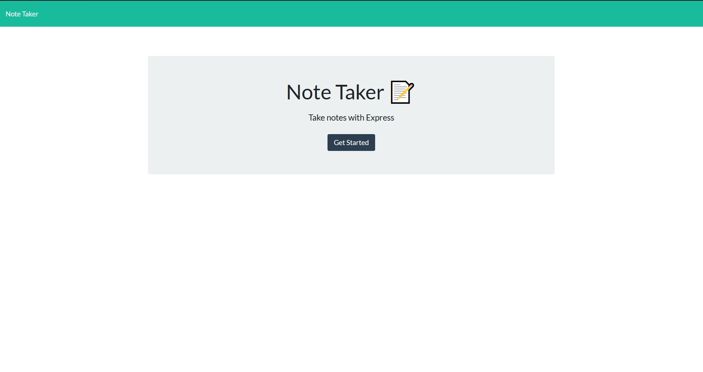
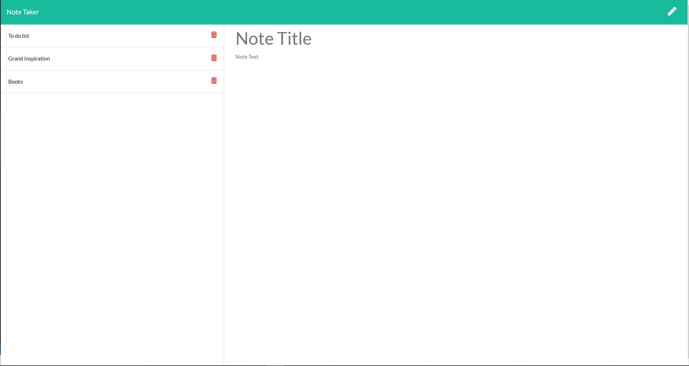

# Note Taker
   
  ## Description
  A simple note taking application that allows users to write, save, view, and delete notes.
  
  ## Deployed Application
  https://not3takr.herokuapp.com/
  
  ## Screenshots
  
   
  
  ## Usage
  Click 'Get Started' on the homepage and user will be taken to the notes page. Click the pencil button in the right corner or just start typing. Upon a title and content being        entered, a save button will appear. Click the button to save. Any saved notes will remain listed until they are deleted by clicking the trash can icon next to the note. Enjoy!
  
  ## Technologies
  <ul><li>JavaScript/Jquery/Ajax</li>
  <li>HTML/CSS/Bootstrap</li>
  <li>Express.js</li>
  <li>Node.js</li>
  <li>Heroku</li></ul>
  
  ## Contributing
  Julia Tocker
  ## Questions
  Check out my github profile at [Github](http://github.com/j9210)

  Contact me at <juliaolivia.t@gmail.com>
